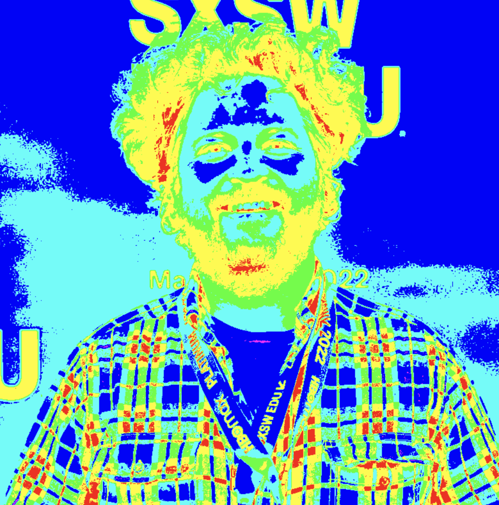
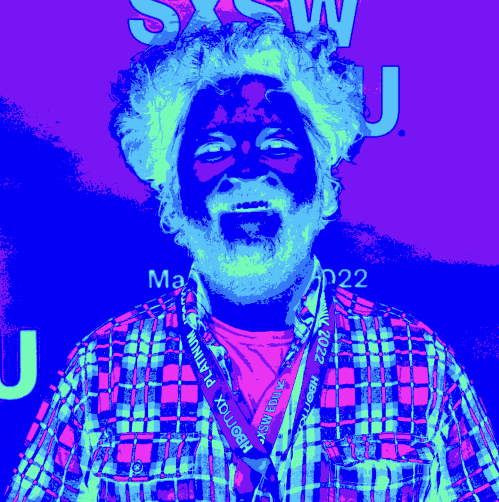

# Filter-code
This code splits an image by grayscale value and assigns colors to groups of values 

# Start with an input image like this:

# The program then converts the image into a grayscale vector:

# Next the grayscale image is broken into 6 sub-images based on an adjustable filter:

# Finally, each subimage gets mapped to a new color:

