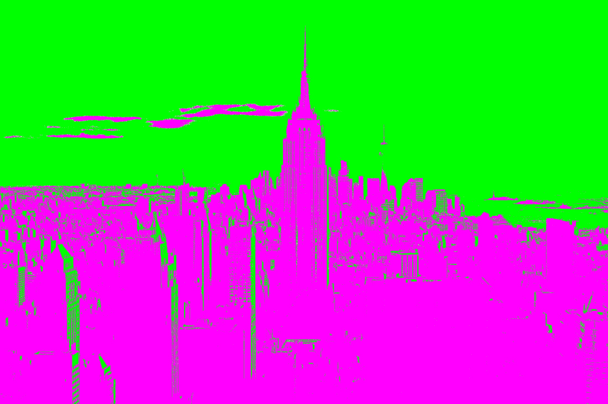

# Copmuter Vision Filtering Art
This progam uses the OpenCV library computer vision tools to generate Pop Art! 

# Requirements
colr==0.9.1
numpy==1.23.5

# First, the user is prompted to enter an image:
For purpose of demonstration, this readme will work with this image of the manhatten skyline. 
Credit: https://rare-gallery.com/120453-empire-state-building-skyscrapers-manhattan-new-york-city-cityscape-skyline-usa-hd.html

# The program then converts the image into a grayscale array:
The original image was a 3d array to account for the RGB values of each pixel. Now the image is in 2d.

# Next the grayscale image is broken into sub arrays based breakpoint values:
The program will divide the grayscale image into n equal parts based on brightness. The below example has been divided twice. 

# Next, each sub array is mapped to a new color:
The colors chosen here represent the hsv spectrum divided into n parts based on hue, more on this later.

# The image can be divided into n sub arrays:
Here is an exmaple with 9 sub-divisions

# The blend function is accomplished in HSV color space

Image credit: https://medium.com/neurosapiens/segmentation-and-classification-with-hsv-8f2406c62b39
The program chooses two colors at random to serve as bounds for a gradient. The gradient is calculated using simple linear interpolation.

# Here are some final results!

